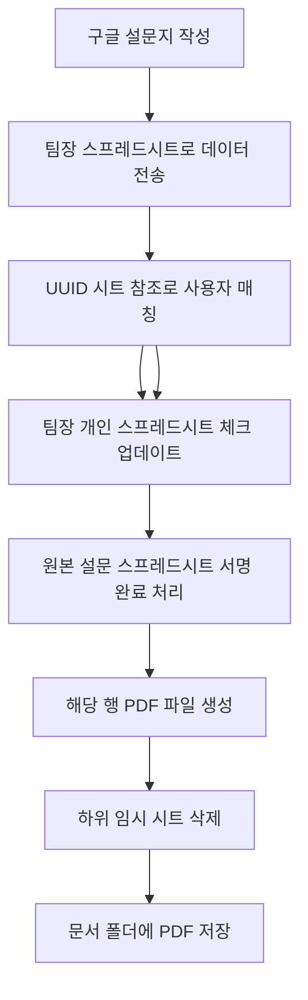

# 🔄 미쓰리 서명 시스템 워크플로우 정리

## 📋 전체 프로세스 개요

## 🔍 단계별 상세 설명

### **1단계: 구글 설문지 작성**
- **주체**: 일반 사용자
- **결과**: 설문 응답이 구글 스프레드시트에 기록
- **다음 단계 트리거**: 새로운 응답 행 생성

---

### **2단계: 팀장 스프레드시트로 데이터 전송**
- **시스템**: Google Apps Script가 새 설문 응답 감지
- **매칭 과정**:
  1. 설문 응답에서 **작성자** 정보 추출
  2. UUID 시트에서 **작성자 → 담당 팀장** 매핑 정보 찾기
  3. 해당 팀장의 개인 스프레드시트 ID 확인
- **동작**: 설문 응답 내용을 **해당 팀장의** 개인 스프레드시트로 전송 및 정리
- **결과**: 올바른 팀장 스프레드시트에 서명 대기 문서 추가

### **3단계: UUID 시트 참조로 사용자 매칭**
- **위치**: UUID 시트 (이메일 ↔ 스프레드시트 ID 매핑 테이블)
- **매칭 과정**: 
  1. 사용자가 회원가입 시 입력한 이메일 주소
  2. UUID 시트에서 해당 이메일과 매칭되는 스프레드시트 ID 찾기
  3. 해당 팀장의 개인 스프레드시트에 접근
- **연결**: Next.js 프로젝트가 이메일 기반으로 올바른 개인 대시보드 표시

---

### **4단계: 팀장 로그인 & 서명 처리**
- **주체**: 팀장 (이 Next.js 프로젝트 사용)
- **동작**: 
  1. 서명대시보드 로그인
  2. 미서명 문서 목록 확인
  3. "서명하기" 버튼 클릭

---

### **4단계: 개인 스프레드시트 업데이트**
- **위치**: 팀장별 개인 스프레드시트
- **동작**: 특정 셀/행에 서명 완료 체크 표시
- **예시**: `L열`에 `TRUE` 값 입력

---

### **5단계: 원본 설문 스프레드시트 서명 완료**
- **위치**: 최초 설문지 응답이 저장된 스프레드시트
- **동작**: 해당 응답 행에 서명 완료 상태 업데이트
- **트리거**: Google Apps Script가 개인 스프레드시트 변경 감지

---

### **6단계: PDF 파일 생성**
- **소스**: 서명 완료된 응답 행의 모든 데이터
- **생성 위치**: "문서" 폴더 (Google Drive)
- **파일명**: 응답 내용 기반 (예: `휴가신청서_김철수_20250915.pdf`)

---

### **7단계: 임시 시트 정리**
- **동작**: 하위/임시 시트 삭제
- **목적**: 데이터 정리 및 용량 최적화

---

### **8단계: 최종 저장**
- **위치**: "문서" 폴더
- **내용**: 완성된 PDF 파일 (응답 데이터 + 서명 정보)

## 🏗️ 시스템 구성 요소

### **A. Google Forms (설문지)**
- 사용자 입력 인터페이스
- 자동으로 스프레드시트에 응답 저장

### **B. Google Sheets (여러 개)**
1. **원본 설문 응답 시트**: 모든 설문 응답 저장
2. **UUID 시트**: 다중 매핑 테이블
   - **이메일 ↔ 스프레드시트 ID** (팀장 로그인용)
   - **작성자 ↔ 담당 팀장** (설문 응답 라우팅용)
3. **팀장별 개인 시트**: 각 팀장의 서명 대기/완료 목록
4. **임시 하위 시트**: 처리 중 임시 데이터 저장

### **C. Google Apps Script**
- 시트 간 데이터 연동
- PDF 생성 로직
- 서명 완료 시 후처리

### **D. Next.js 서명 대시보드 (현재 프로젝트)**
- 팀장 로그인 인터페이스
- 미서명 문서 목록 표시
- 서명 처리 UI

### **E. Google Drive "문서" 폴더**
- 최종 PDF 파일 저장소

## ⚡ 성능 병목 지점 예상

### **🐌 느려질 수 있는 구간:**

1. **2단계**: UUID 시트에서 **작성자 → 팀장 매칭** 조회 (첫 번째 병목)
2. **3단계**: UUID 시트에서 **이메일 → 스프레드시트 ID** 조회 (두 번째 병목)  
3. **5→6단계**: 개인 시트 업데이트 → 원본 시트 반영
4. **7단계**: PDF 생성 (가장 오래 걸릴 것으로 예상)
5. **8단계**: 임시 시트 삭제

### **🔧 최적화 포인트:**
- Google Apps Script 실행 시간 최적화
- PDF 생성 로직 효율화
- 불필요한 시트 읽기/쓰기 최소화

## 📁 관련 파일들

### **현재 프로젝트에서:**
- `src/lib/services/DocumentSheetService.ts` - 문서 조회/서명 처리
- `src/lib/services/UserSheetService.ts` - 사용자(팀장) 관리
- `src/api/documents/sign/route.ts` - 서명 API 엔드포인트

### **Google Apps Script (확인 필요):**
- 설문 응답 감지 스크립트
- PDF 생성 스크립트
- 시트 간 데이터 연동 스크립트

## ❓ 확인 필요사항

1. **Google Apps Script 코드** - 어느 부분이 가장 오래 걸리는지
2. **PDF 생성 방식** - 템플릿 기반인지, 동적 생성인지
3. **시트 구조** - 각 스프레드시트의 정확한 구조
4. **트리거 설정** - 어떤 이벤트가 어떤 스크립트를 실행하는지

---

*이 워크플로우가 맞는지 확인해주시고, 틀린 부분이나 빠진 부분이 있으면 알려주세요! 그 다음에 Google Apps Script 예시 코드를 보여주시면 정확한 최적화 방안을 제시해드릴게요.* 🚀